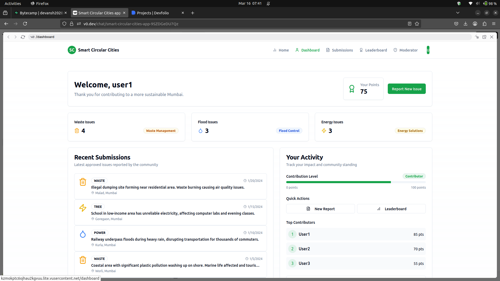
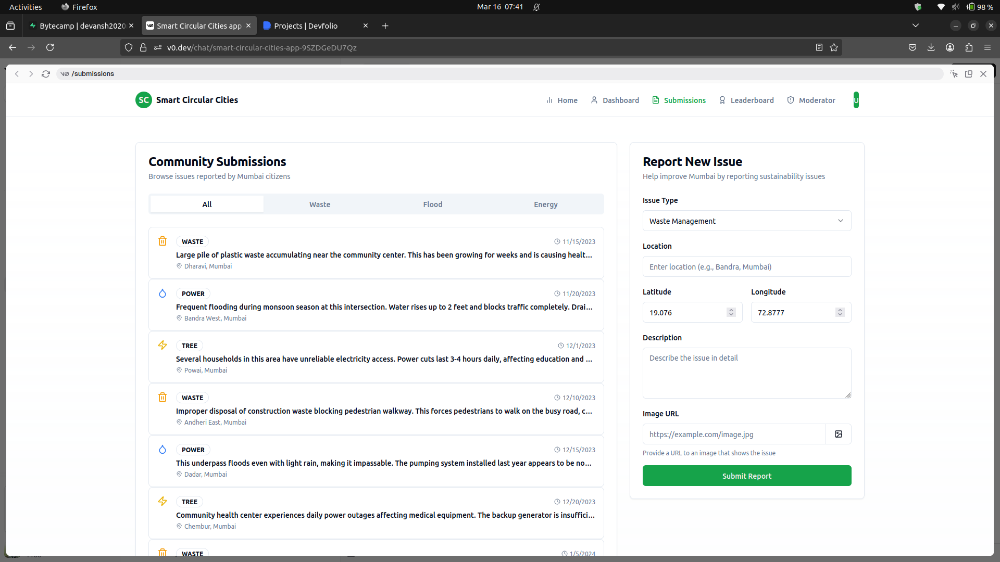
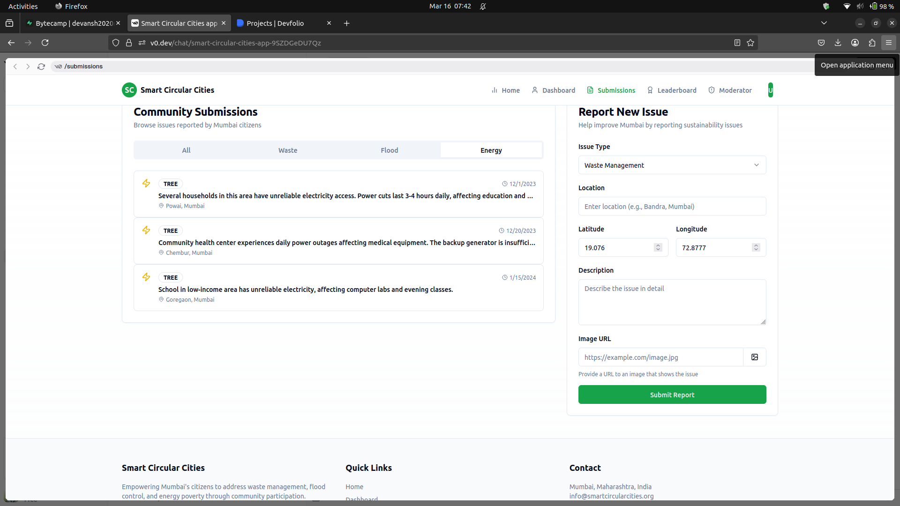
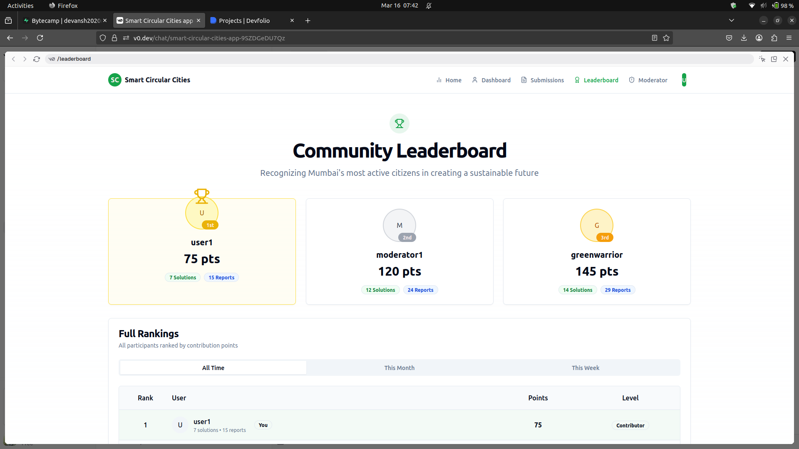
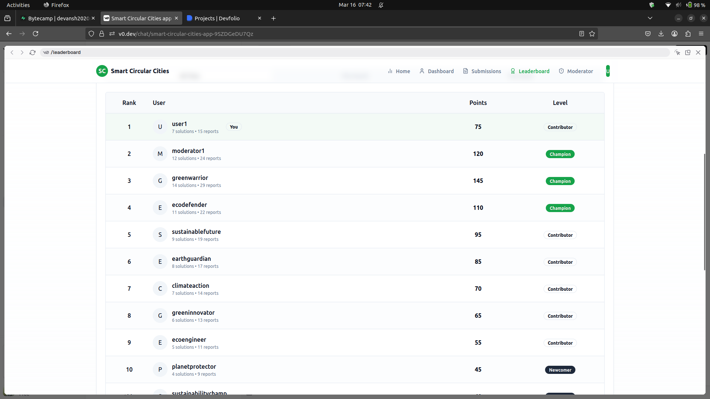
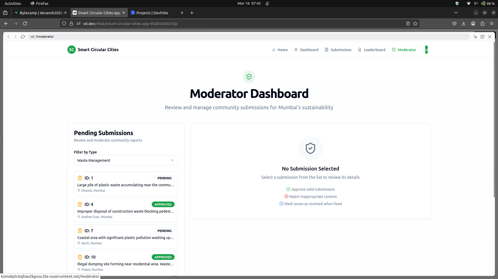
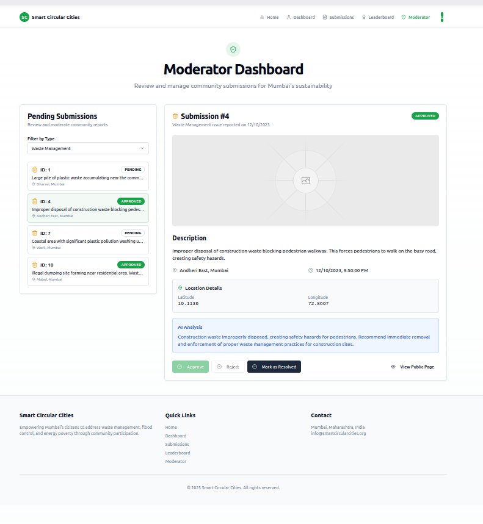
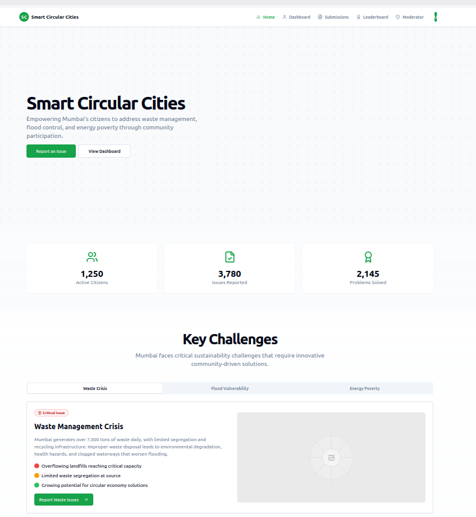
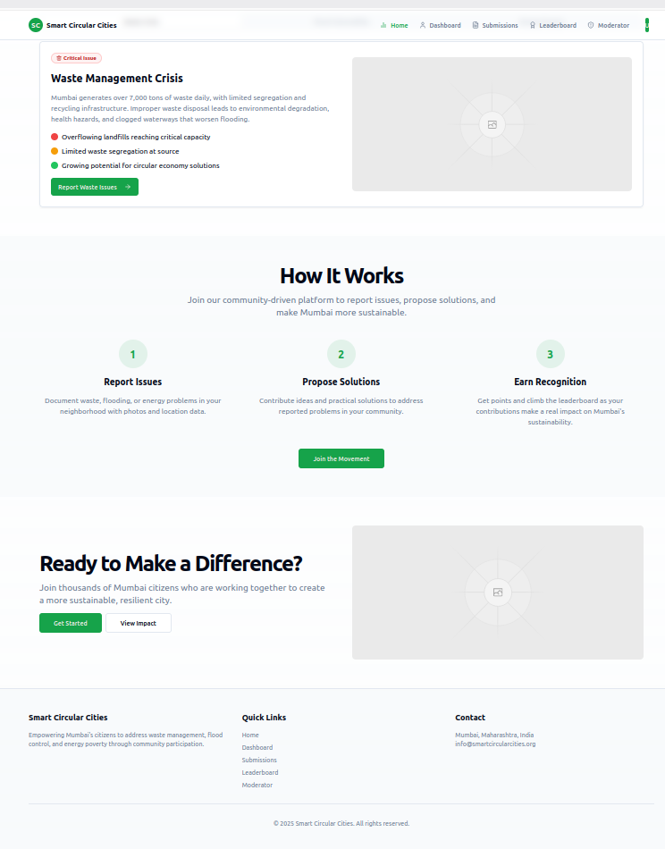
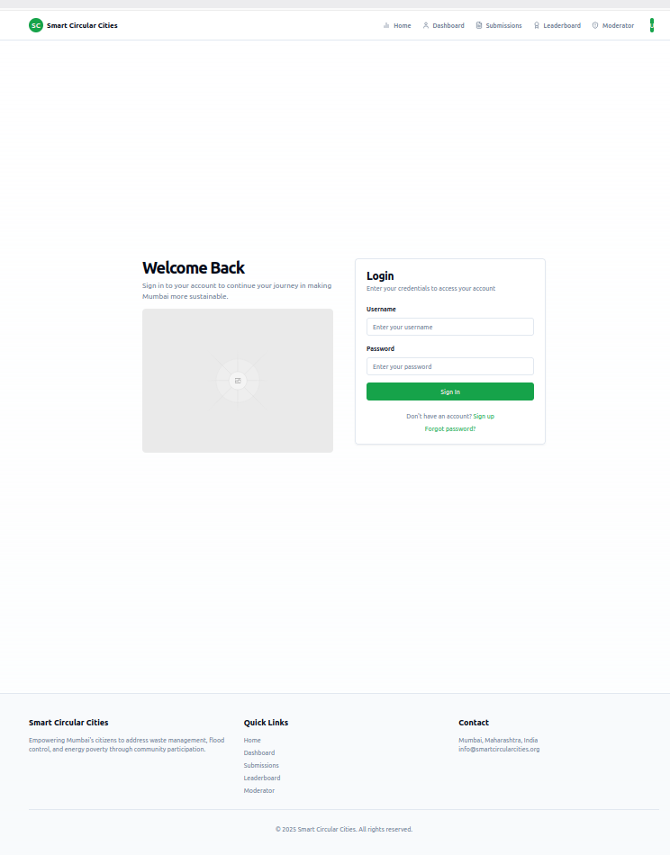

# Smart Circular Cities & ROSphere

This repository contains two integrated platforms:

1. **Smart Circular Cities** - A full-stack web application designed to empower Mumbai's citizens by leveraging technology to tackle urban challenges such as waste management, flood control, and energy poverty.

2. **ROSphere** - Advanced ROS 2 development tools for rapid prototyping and deployment of robotic applications.

## ROSphere Phase 1 - Foundation Tools

ROSphere is a comprehensive suite of tools designed to simplify ROS 2 development with visual interfaces and automated code generation.

### 🚀 Features

#### Graphical Project Wizard
- Web-based interface for creating ROS 2 workspaces and packages
- Form-driven configuration with validation
- Auto-generation of CMakeLists.txt, package.xml, and launch files
- Support for multiple node types (publisher, subscriber, service, action)

#### Intelligent Launch Composer
- Visual drag-and-drop interface for building launch files
- Node connection visualization
- QoS settings configuration
- Export to standard ROS 2 launch file formats (Python, XML, YAML)

#### ROS 2 Boilerplate Generator
- CLI tool for generating common ROS 2 patterns
- Template system for different node types
- Multi-language support (C++, Python)
- Custom template creation

#### Command-Line Tools
- `rosphere` CLI for automated project generation
- Docker integration for containerized development
- CI/CD integration capabilities

### 🛠 Tech Stack

- **Frontend**: React 18+ with TypeScript, Next.js 15, Tailwind CSS
- **Backend**: Python 3.8+ with FastAPI, Pydantic
- **ROS Integration**: ROS 2 Humble/Iron/Jazzy compatibility
- **Containerization**: Docker & Docker Compose
- **CLI Tools**: Python with Click/argparse

## Quick Start

### Prerequisites

- Ubuntu 20.04+ or equivalent Linux distribution
- ROS 2 Humble, Iron, or Jazzy installed
- Node.js 16+ and Python 3.8+
- Docker (optional, for containerized development)

### Installation

#### Method 1: Docker (Recommended)

```bash
git clone https://github.com/devansh0703/Bitflippers_ByteCamp2025.git
cd Bitflippers_ByteCamp2025

# Start all services
docker-compose up -d

# Access applications
# ROSphere: http://localhost:3000/rosphere
# Smart Circular Cities: http://localhost:3000
# API: http://localhost:8000
```

#### Method 2: Local Development

```bash
git clone https://github.com/devansh0703/Bitflippers_ByteCamp2025.git
cd Bitflippers_ByteCamp2025

# Install frontend dependencies
npm install --force

# Install backend dependencies
pip install -r requirements.txt

# Start backend (Terminal 1)
python main.py

# Start frontend (Terminal 2)
npm run dev
```

### ROS 2 Setup

```bash
# Install ROS 2 Humble (Ubuntu 22.04)
sudo apt update && sudo apt install curl
curl -sSL https://raw.githubusercontent.com/ros/rosdistro/master/ros.key -o /usr/share/keyrings/ros-archive-keyring.gpg
echo "deb [arch=$(dpkg --print-architecture) signed-by=/usr/share/keyrings/ros-archive-keyring.gpg] http://packages.ros.org/ros2/ubuntu $(. /etc/os-release && echo $UBUNTU_CODENAME) main" | sudo tee /etc/apt/sources.list.d/ros2.list > /dev/null

sudo apt update
sudo apt install ros-humble-desktop

# Source ROS 2
source /opt/ros/humble/setup.bash
echo "source /opt/ros/humble/setup.bash" >> ~/.bashrc
```

## ROSphere Tools Usage

### 1. Project Wizard

Navigate to `http://localhost:3000/rosphere/wizard` to:

1. **Create Workspace**: Configure ROS 2 workspace with distribution and build tools
2. **Setup Package**: Define package metadata, dependencies, and node types
3. **Generate Project**: Automatically create all necessary files and folders

### 2. Launch Composer

Navigate to `http://localhost:3000/rosphere/composer` to:

1. **Drag & Drop Nodes**: Add nodes from the template palette
2. **Configure Properties**: Set node parameters, topics, and QoS settings
3. **Visual Connections**: See how nodes communicate
4. **Generate Launch Files**: Export to Python launch files

### 3. Code Generator

Navigate to `http://localhost:3000/rosphere/generator` to:

1. **Select Templates**: Choose from publisher, subscriber, service templates
2. **Configure Parameters**: Set node names, topics, message types
3. **Generate Code**: Create C++ or Python node implementations
4. **Download**: Save generated code files

### 4. CLI Tools

```bash
# Install CLI tool
python rosphere_cli.py --help

# Create workspace
python rosphere_cli.py create workspace my_robot_ws --path ~/ros2_ws

# Create package
cd ~/ros2_ws
python rosphere_cli.py create package hello_world --lang cpp

# Generate nodes
python rosphere_cli.py generate node publisher --package hello_world --topic /hello
python rosphere_cli.py generate node subscriber --package hello_world --topic /hello

# Build and run
colcon build
source install/setup.bash
ros2 run hello_world publisher_node  # Terminal 1
ros2 run hello_world subscriber_node # Terminal 2
```

## Example: Creating Your First ROS 2 Project

### Using the Web Interface

1. Go to http://localhost:3000/rosphere/wizard
2. **Workspace Setup**:
   - Name: `my_robot_workspace`
   - Path: `/home/user/ros2_ws`
   - ROS Distro: `Humble`
   - Build Tool: `Colcon`

3. **Package Configuration**:
   - Name: `hello_robot`
   - Language: `C++`
   - Node Types: Select `Publisher` and `Subscriber`
   - Maintainer: Your name and email

4. **Generate Project**: Click generate and download the created workspace

### Using the CLI

```bash
# Create workspace and package
python rosphere_cli.py create workspace my_robot_workspace --path ~/ros2_ws
cd ~/ros2_ws
python rosphere_cli.py create package hello_robot --lang cpp

# Generate nodes
python rosphere_cli.py generate node publisher --package hello_robot --topic /hello_topic
python rosphere_cli.py generate node subscriber --package hello_robot --topic /hello_topic

# Build and test
colcon build --packages-select hello_robot
source install/setup.bash

# Run nodes (in separate terminals)
ros2 run hello_robot publisher_node
ros2 run hello_robot subscriber_node
```

## API Endpoints

### ROSphere API

- **POST** `/rosphere/generate-project` - Generate complete ROS 2 project
- **GET** `/rosphere/templates` - Get available templates and options

### Smart Circular Cities API

- **POST** `/login` - User authentication
- **POST** `/users/create` - Create new user
- **GET** `/submissions` - Get submissions
- **POST** `/submissions` - Create submission
- **GET** `/leaderboard` - Get user rankings

## Project Structure

```
├── app/                          # Next.js frontend
│   ├── rosphere/                 # ROSphere pages
│   │   ├── wizard/              # Project Wizard
│   │   ├── composer/            # Launch Composer  
│   │   ├── generator/           # Code Generator
│   │   ├── docs/                # Documentation
│   │   └── cli/                 # CLI Tools info
│   ├── dashboard/               # Smart Cities dashboard
│   ├── submissions/             # Submissions management
│   └── ...
├── components/                   # Reusable UI components
├── main.py                      # FastAPI backend
├── rosphere_cli.py              # CLI tool
├── docker-compose.yml           # Docker services
├── Dockerfile.*                 # Docker configurations
└── requirements.txt             # Python dependencies
```

## Development

### Adding New Node Templates

1. **Backend**: Add template in `main.py` under `generate_*_node` functions
2. **Frontend**: Update templates in `app/rosphere/generator/page.tsx`
3. **CLI**: Add template function in `rosphere_cli.py`

### Adding New Features

1. Create new pages in `app/rosphere/`
2. Add API endpoints in `main.py`
3. Update navigation in `app/clientLayout.tsx`

## Contributing

1. Fork the repository
2. Create a feature branch
3. Make your changes
4. Add tests if applicable
5. Submit a pull request

## Troubleshooting

### Common Issues

**"ROS 2 not found" error**
```bash
source /opt/ros/humble/setup.bash
```

**Build fails with "package not found"**
```bash
rosdep install --from-paths src --ignore-src -r -y
```

**Frontend build errors**
```bash
rm -rf node_modules package-lock.json
npm install --force
```

## License

This project is licensed under the MIT License - see the LICENSE file for details.

## Acknowledgments

- ROS 2 Community for excellent documentation and examples
- Next.js team for the amazing React framework
- FastAPI team for the high-performance Python web framework

---

For more detailed documentation, visit the [ROSphere Documentation](http://localhost:3000/rosphere/docs) page when the application is running.

## UI





















## Installation & Setup

### Prerequisites
- **Node.js & npm**: Make sure Node.js (and npm) is installed. You can download it from [nodejs.org](https://nodejs.org).
- **Python**: Ensure Python 3.x is installed.
- **Supabase Account**: Set up a Supabase project and update the backend credentials in `main.py`.

### Clone the Repository
```bash
git clone https://github.com/devansh0703/Bitflippers_ByteCamp2025.git
cd Bitflippers_ByteCamp2025/
```

### Install Dependencies

For the Frontend (Next.js):
```bash
npm install
```

For the Backend (FastAPI):
```bash
pip install -r requirements.txt
```

> Note: If you don't have a requirements.txt, ensure you have installed FastAPI, Uvicorn, Pydantic, and the Supabase client along with any other dependencies (e.g., requests, google-generativeai).

### Running the Application

Start the FastAPI Backend:
```bash
python main.py
```
This starts the backend on http://localhost:8000.

Start the Next.js Frontend:
```bash
npm run dev
```
This starts the frontend on http://localhost:3000.

## Usage

### User & Moderator Signup/Login
Create accounts using the provided endpoints. Use the `/login` endpoint to log in and store the user data (including the role) in localStorage.

### Submissions
- Users can create new submissions by providing details such as submission type, location, description, and an image URL
- The backend validates for duplicate submissions (based on image URL) and integrates GenAI analysis

### Moderator Dashboard
- Only users with the role "moderator" can view the Moderator Dashboard
- Moderators can approve/reject submissions and manually resolve issues. Points are awarded and email notifications are sent accordingly

### Leaderboard
Displays a ranked list of users by points.

## API Endpoints

Below is a summary of the key API endpoints in the backend:

- **GET /**  
  Health check endpoint.

- **POST /login**  
  Log in a user. Expects JSON payload with username and password.

- **POST /users/create**  
  Create a new user or moderator. Expects JSON payload with username, email, password, and role.

- **GET /users**  
  Retrieve all users.

- **POST /submissions**  
  Create a new submission. Expects details like user_id, submission_type, location, latitude, longitude, description, and image_url.

- **GET /submissions**  
  Retrieve submissions, filterable by status and type.

- **GET /submissions/{submission_id}**  
  Retrieve details of a specific submission.

- **GET /moderator/submissions**  
  Retrieve pending submissions for a given type (for moderators).

- **POST /moderator/approve**  
  Approve or reject a submission (for moderators). Points are awarded and email notifications are sent.

- **POST /moderator/resolve**  
  Manually resolve a submission (for moderators). Points are awarded and notifications sent.

- **GET /moderator/approvals**  
  Retrieve moderator approval logs.

- **GET /leaderboard**  
  Retrieve a leaderboard of users sorted by points in descending order.
