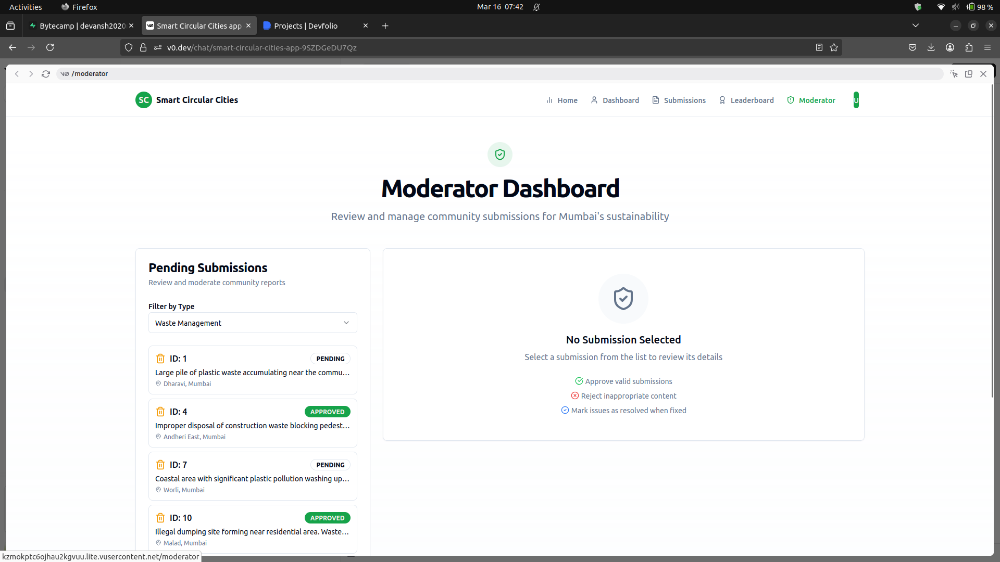

# Smart Circular Cities

Smart Circular Cities is a full-stack web application designed to empower Mumbai's citizens by leveraging technology to tackle urban challenges such as waste management, flood control, and energy poverty. The project consists of a FastAPI backend and a Next.js frontend (using the App Router). Users can log in, create submissions (issues), and even submit solutions. Moderators can review and approve submissions, awarding points and sending automated email notifications. Additionally, the system integrates GenAI analysis for submissions to help determine authenticity and provide detailed insights.

## Quick Start

```bash
git clone https://github.com/devansh0703/Bitflippers_ByteCamp2025.git
cd ByteCamp
npm install --force
pip install -r requirements.txt
python main.py
npm run dev
```

## Features

### User Authentication & Management
- Create accounts for users and moderators
- Secure login and logout

### Submissions & Solutions
- Users can create submissions (e.g., issues related to waste, power, or tree plantation)
- Users can also submit solutions to existing issues
- Duplicate submissions (based on image URL within a week) are prevented on the backend

### Moderator Dashboard
- Moderators can view pending submissions
- Approve or reject submissions
- Award points to users for approved submissions and solutions
- Automated email notifications on submission creation, approval, and resolution

### GenAI Integration
- Automatically generates a GenAI analysis based on the submission description and image

### Leaderboard
- Displays users sorted by points, promoting healthy competition and community engagement

## UI





## Installation & Setup

### Prerequisites
- **Node.js & npm**: Make sure Node.js (and npm) is installed. You can download it from [nodejs.org](https://nodejs.org).
- **Python**: Ensure Python 3.x is installed.
- **Supabase Account**: Set up a Supabase project and update the backend credentials in `main.py`.

### Clone the Repository
```bash
git clone https://github.com/devansh0703/Bitflippers_ByteCamp2025.git
cd Bitflippers_ByteCamp2025/
```

### Install Dependencies

For the Frontend (Next.js):
```bash
npm install
```

For the Backend (FastAPI):
```bash
pip install -r requirements.txt
```

> Note: If you don't have a requirements.txt, ensure you have installed FastAPI, Uvicorn, Pydantic, and the Supabase client along with any other dependencies (e.g., requests, google-generativeai).

### Running the Application

Start the FastAPI Backend:
```bash
python main.py
```
This starts the backend on http://localhost:8000.

Start the Next.js Frontend:
```bash
npm run dev
```
This starts the frontend on http://localhost:3000.

## Usage

### User & Moderator Signup/Login
Create accounts using the provided endpoints. Use the `/login` endpoint to log in and store the user data (including the role) in localStorage.

### Submissions
- Users can create new submissions by providing details such as submission type, location, description, and an image URL
- The backend validates for duplicate submissions (based on image URL) and integrates GenAI analysis

### Moderator Dashboard
- Only users with the role "moderator" can view the Moderator Dashboard
- Moderators can approve/reject submissions and manually resolve issues. Points are awarded and email notifications are sent accordingly

### Leaderboard
Displays a ranked list of users by points.

## API Endpoints

Below is a summary of the key API endpoints in the backend:

- **GET /**  
  Health check endpoint.

- **POST /login**  
  Log in a user. Expects JSON payload with username and password.

- **POST /users/create**  
  Create a new user or moderator. Expects JSON payload with username, email, password, and role.

- **GET /users**  
  Retrieve all users.

- **POST /submissions**  
  Create a new submission. Expects details like user_id, submission_type, location, latitude, longitude, description, and image_url.

- **GET /submissions**  
  Retrieve submissions, filterable by status and type.

- **GET /submissions/{submission_id}**  
  Retrieve details of a specific submission.

- **GET /moderator/submissions**  
  Retrieve pending submissions for a given type (for moderators).

- **POST /moderator/approve**  
  Approve or reject a submission (for moderators). Points are awarded and email notifications are sent.

- **POST /moderator/resolve**  
  Manually resolve a submission (for moderators). Points are awarded and notifications sent.

- **GET /moderator/approvals**  
  Retrieve moderator approval logs.

- **GET /leaderboard**  
  Retrieve a leaderboard of users sorted by points in descending order.
